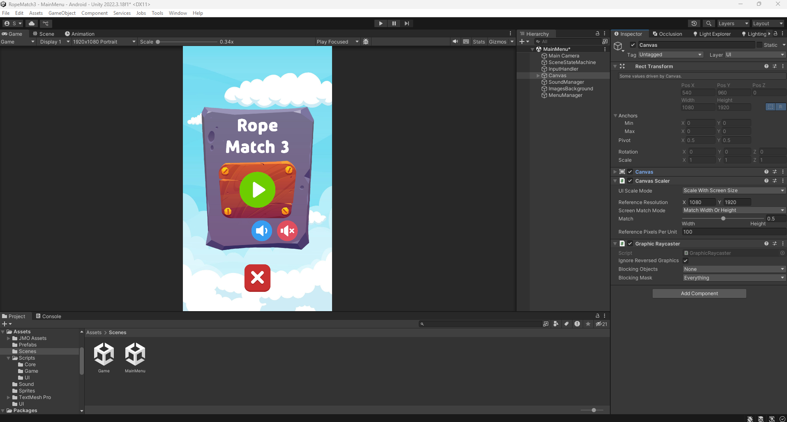
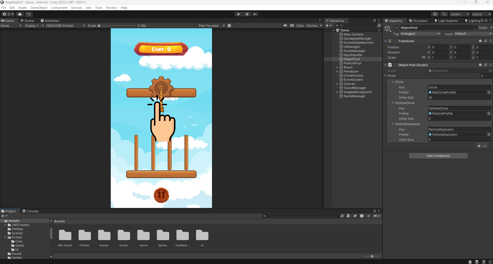
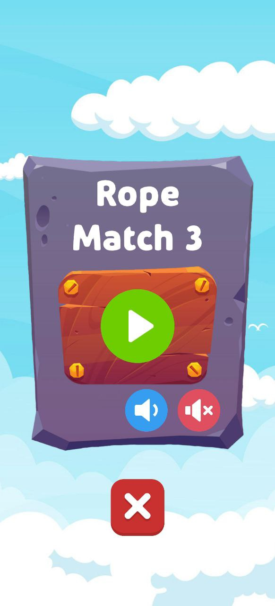
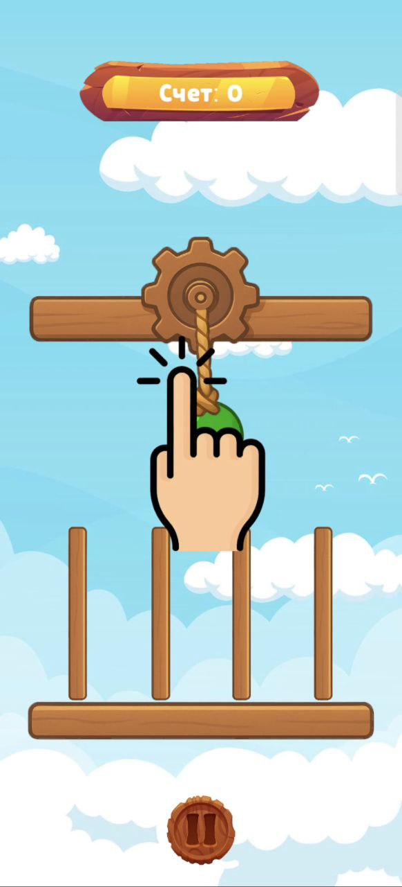
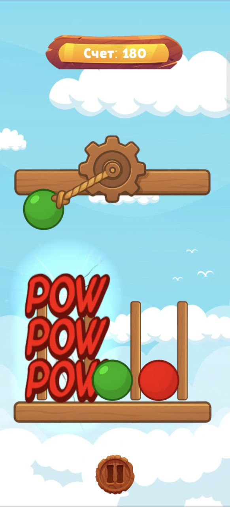
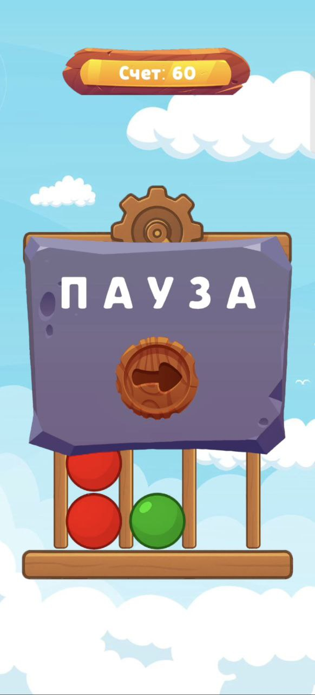
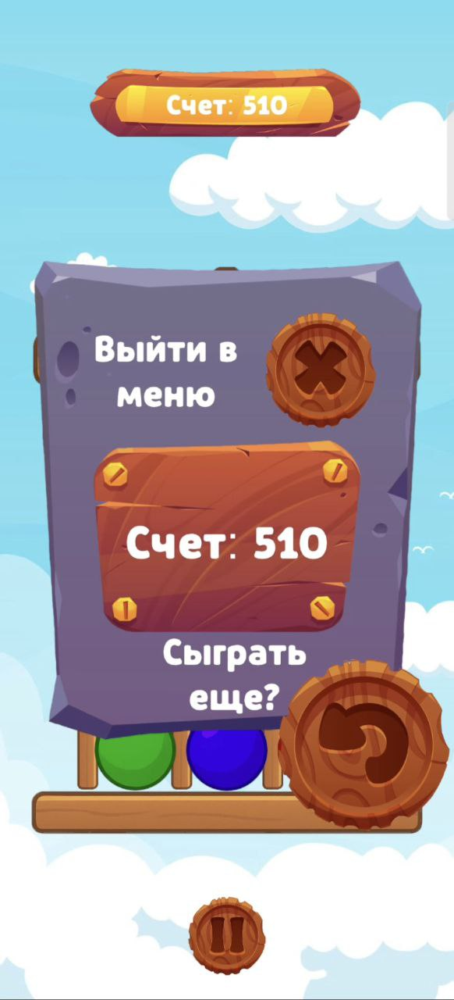

# Rope-Match3-Game
Классическая 2D-игра. Собрать 3 одинаковых шара в линию.
Unity 2022.3.18
Особенности:
Основной цикл игры: 
- Игрок нажимает на экран и роняет шар с маятника в нужный столбец;
- Реализована логика системы grid считывание и обновление ячеек после каждого хода (проверка строки, столбца, диагоналей);
- Реализовано случайное появление шара на маятнике (есть 3 цвета шаров);
- Аккумуляция очков;
- Добавлено игровое меню, а также меню "Пауза";
- Добавлены визуальные эфекты (VFX), звуковые эффекты (SFX);
- Реализовано управление звуком, можно выбрать оставить звук или выключить, через панель в "Главном меню".

На данную реализацию было затрачено примерно 18 (+-) часов.

<table>
    <tr>
        <td>
            
        </td>
    </tr>
    <tr>
        <td>
            
        </td>
    </tr>
    <tr>
        <td>
            
        </td>
    <tr>
    <tr>
        <td>
            
        </td>
    <tr>
      <tr>
        <td>
            
        </td>
    <tr>
    <tr>
        <td>
            
        </td>
    <tr>
      <tr>
        <td>
            
        </td>
    <tr>
</table>
